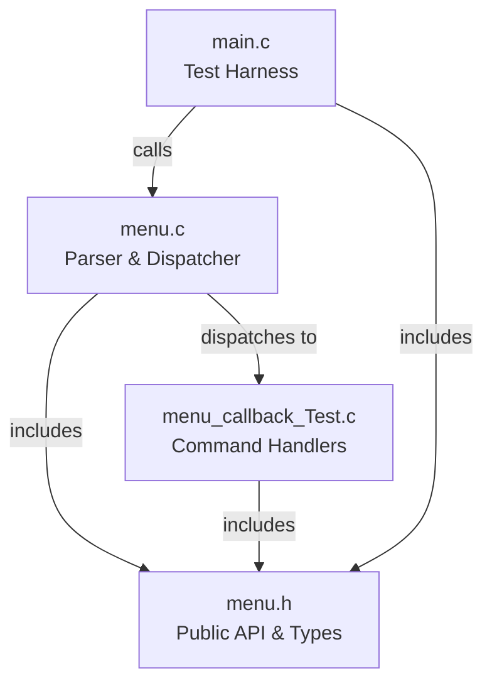
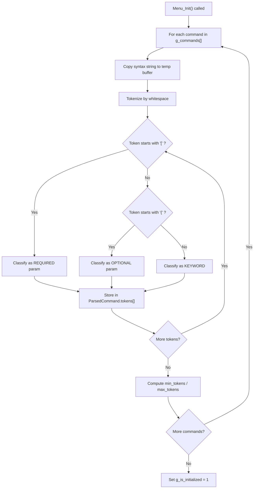
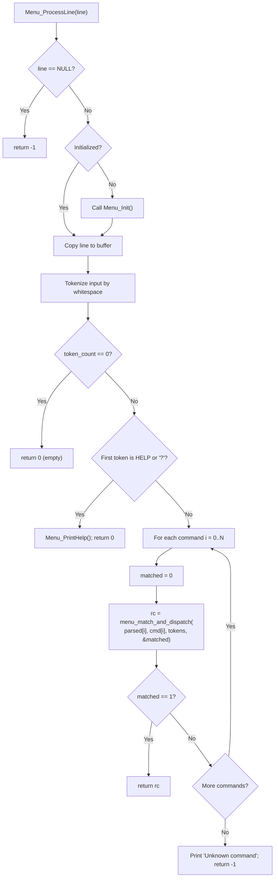
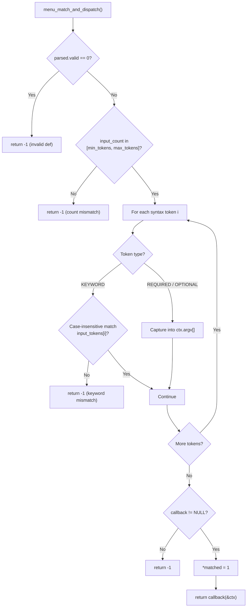
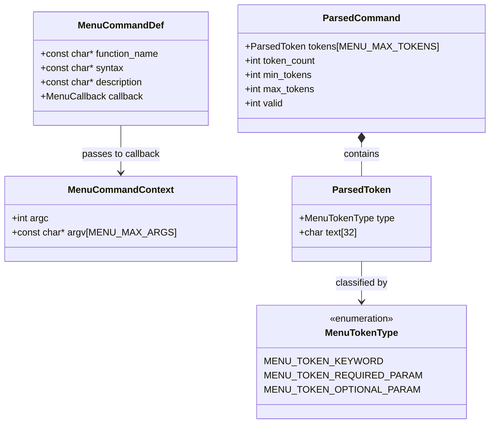

<!--
Copyright (C) 2026 — Generated by MenuBuilder AI, inspired by Steve Spano
                      (SteveSpano009@gmail.com)

SPDX-License-Identifier: LGPL-2.1-or-later
-->

# DAQ Menu System — Design Documentation

**Generated:** 2026-02-27  
**Revision:** 1.0  
**Source:** `menu_commands_daq.txt`

---

## 1. Overview

This document describes the generated DAQ (Data Acquisition) command menu system. The system provides an interactive command-line interface for controlling a data acquisition subsystem. It is built entirely in portable ISO C11 and can be compiled and run on both Windows and Linux using GCC.

The menu system consists of four source files and two build scripts. A user types commands at a prompt; the parser tokenizes the input, matches keywords and parameters against a pre-parsed command table, and dispatches to the appropriate callback function. The system handles required and optional parameters, case-insensitive keyword matching, aligned help output, and explicit match signaling to prevent false-positive dispatch.

---

## 2. Architecture Overview

The following diagram shows the high-level relationships between the generated source files.



**main.c** provides the user-facing entry point — either an interactive prompt or a `--demo` mode that runs canned commands. It calls `Menu_Init()` once, then feeds each input line to `Menu_ProcessLine()`.

**menu.c** contains the parser and dispatcher. It owns the command table (`g_commands[]`), pre-parses each command syntax into metadata at init time, and walks the table on every input line looking for an explicit match.

**menu.h** declares the public API, data types (`MenuCommandDef`, `MenuCommandContext`), macros (`MENU_MAX_INPUT_LEN`, `MENU_MAX_TOKENS`, `MENU_MAX_ARGS`), and forward-declares all callback functions.

**menu_callback_Test.c** implements stub callbacks that print parsed arguments to stdout. These are replaced with real hardware logic when integrating into a target.

---

## 3. Initialization Flow

When `Menu_Init()` is called (or lazily triggered by the first call to `Menu_ProcessLine()`), it iterates over every entry in `g_commands[]` and pre-parses the syntax string into a `ParsedCommand` structure containing token classifications and token-count bounds.



After initialization, the `g_parsed_commands[]` array holds pre-computed metadata for every command, enabling fast rejection during dispatch without re-parsing syntax strings on each input.

---

## 4. Command Processing & Dispatch Flow

`Menu_ProcessLine()` is the main entry point for processing user input. It handles null checks, lazy initialization, tokenization, built-in commands (HELP, ?, EXIT), and the dispatch loop.



The critical detail: the dispatch loop does NOT use the return code to determine whether a command matched. It checks the explicit `matched` flag. This prevents a non-matching command that happens to return 0 from terminating the dispatch loop prematurely.

---

## 5. Token Matching Detail

`menu_match_and_dispatch()` is the internal function that determines whether a specific command definition matches the user's input tokens. It performs a multi-stage check and only sets `*matched = 1` after all criteria are satisfied.



The stages are:
1. **Validity check** — reject commands whose syntax had parse errors at init time.
2. **Token count bounds** — fast rejection if the input has too few or too many tokens.
3. **Position-by-position match** — each keyword must match case-insensitively at its exact position; parameters are captured into `ctx.argv[]`.
4. **Callback guard** — reject if the callback pointer is NULL.
5. **Match confirmation** — only after all checks pass is `*matched` set to 1 and the callback invoked.

---

## 6. Data Structures

The following class diagram shows the key structures used by the parser and dispatcher.



**MenuCommandDef** is the static command table entry. One exists per command, generated from the `.txt` input file. It holds the function name (for documentation), the syntax string, help text, and a function pointer.

**MenuCommandContext** is the argument container passed to each callback. `argc` is the number of captured parameters; `argv[]` holds borrowed pointers into the tokenized input buffer.

**ParsedCommand** holds the pre-parsed metadata for one command — the classified tokens and the computed min/max token counts. This is built once during `Menu_Init()` and used on every dispatch.

**ParsedToken** classifies a single syntax token as a keyword, required parameter, or optional parameter, and stores the text (keyword literal or parameter name).

**MenuTokenType** is the three-value enumeration that drives token classification.

---

## 7. Command Reference

The following table lists every command generated from `menu_commands_daq.txt`.

| # | Function | Command Syntax | Required Params | Optional Params | Min Tokens | Max Tokens | Description |
|---|----------|----------------|-----------------|-----------------|------------|------------|-------------|
| 1 | DaqInit | `DAQ INIT [RATE_HZ] {CHANNEL_MASK}` | RATE_HZ | CHANNEL_MASK | 3 | 4 | Initialize acquisition rate and optional channel mask |
| 2 | DaqStart | `DAQ START {DURATION_MS}` | — | DURATION_MS | 2 | 3 | Start acquisition, optionally for a fixed duration |
| 3 | DaqStop | `DAQ STOP` | — | — | 2 | 2 | Stop acquisition |
| 4 | DaqRead | `DAQ READ [CHANNEL]` | CHANNEL | — | 3 | 3 | Read latest sample for a channel |
| 5 | DaqSetGain | `DAQ SET GAIN [CHANNEL] [GAIN_DB]` | CHANNEL, GAIN_DB | — | 5 | 5 | Set channel gain in dB |
| 6 | DaqSetTrigger | `DAQ SET TRIGGER [SOURCE] {LEVEL}` | SOURCE | LEVEL | 4 | 5 | Set trigger source and optional level |
| 7 | DaqStatus | `DAQ STATUS {DETAIL}` | — | DETAIL | 2 | 3 | Show DAQ status |
| 8 | DaqCalibrate | `DAQ CALIBRATE [CHANNEL] {REFERENCE_MV}` | CHANNEL | REFERENCE_MV | 3 | 4 | Calibrate a channel with optional reference value |
| 9 | DaqSaveConfig | `DAQ SAVE CONFIG [NAME]` | NAME | — | 4 | 4 | Save current configuration profile |
| 10 | DaqLoadConfig | `DAQ LOAD CONFIG [NAME]` | NAME | — | 4 | 4 | Load configuration profile |

### Built-in Commands

| Command | Description |
|---------|-------------|
| `HELP` | Display all available commands with aligned descriptions |
| `?` | Alias for HELP |
| `EXIT` | Exit the test harness (handled by main.c, not the parser) |

---

## 8. Build Instructions

### Windows

From a command prompt with GCC (MinGW) on PATH, inside the `ExampleMenu` directory:

```
build.bat          REM compile and link
build.bat run      REM build + interactive mode
build.bat demo     REM build + demo mode
build.bat clean    REM remove build artifacts
```

### Linux / macOS

From a terminal with GCC installed, inside the `ExampleMenu` directory:

```
make               # compile and link
make run           # build + interactive mode
make demo          # build + demo mode
make clean         # remove build artifacts
```

Both build systems use identical compiler flags: `-std=c11 -Wall -Wextra -Werror -pedantic -O2`. The generated code compiles with zero warnings under these strict settings.
