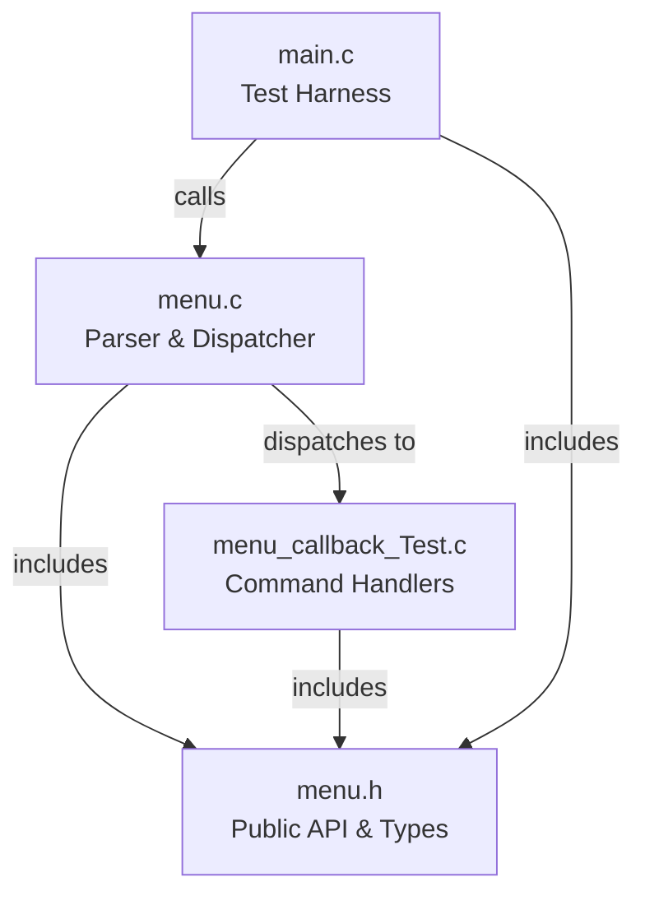
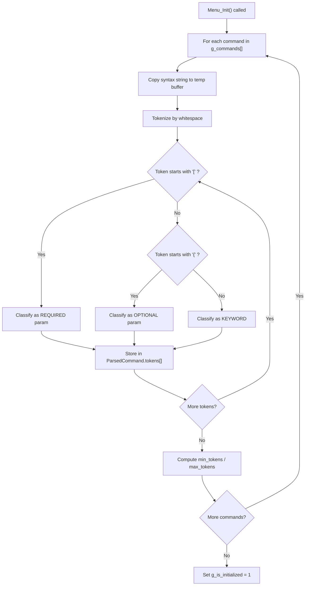
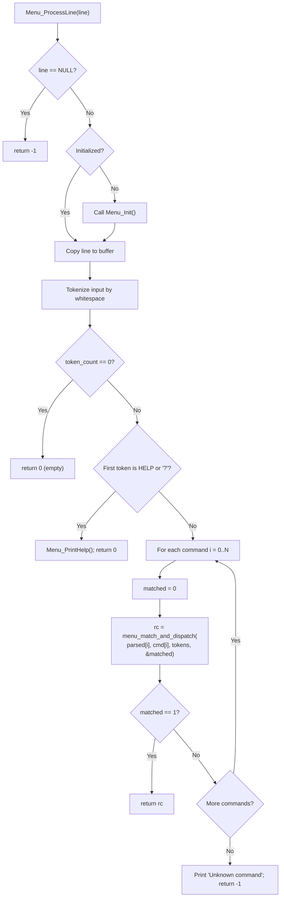
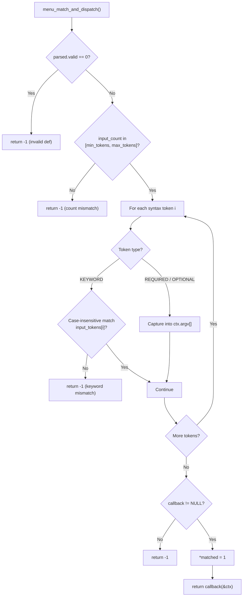
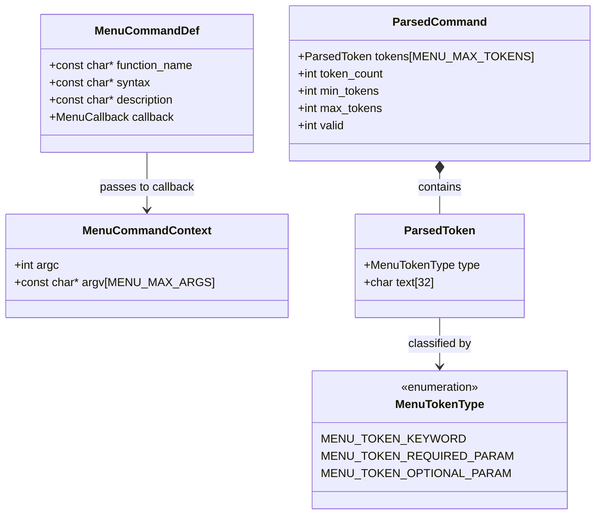

<!--
Copyright (C) 2026 — Generated by MenuBuilder AI, inspired by Steve Spano
                      (SteveSpano009@gmail.com)

This file is free software; you can redistribute it and/or
modify it under the terms of the GNU Lesser General Public
License as published by the Free Software Foundation; either
version 2.1 of the License, or (at your option) any later version.

This file is distributed in the hope that it will be useful,
but WITHOUT ANY WARRANTY; without even the implied warranty of
MERCHANTABILITY or FITNESS FOR A PARTICULAR PURPOSE.  See the GNU
Lesser General Public License for more details.

You should have received a copy of the GNU Lesser General Public
License along with this library; if not, write to the Free Software
Foundation, Inc., 51 Franklin Street, Fifth Floor, Boston, MA  02110-1301
USA

SPDX-License-Identifier: LGPL-2.1-or-later
-->

# MenuBuilder — Embedded C Menu Generator

MenuBuilder is a GPT that generates a **deterministic, portable, embedded-style C command menu system** from a simple text description.  
It produces fully compilable source files suitable for **bare-metal, RTOS, or desktop testing**.

This document explains **exactly how to define commands**, **what code is generated**, and **how the parser works internally**.

---

## 1. What You Provide

You supply a list of commands in the following strict format:

```
FUNCTION:COMMAND:DESCRIPTION
```

### Field Definitions

| Field | Meaning |
|------|--------|
| **FUNCTION** | C callback function name invoked when the command matches |
| **COMMAND** | Full command syntax including keywords and parameters |
| **DESCRIPTION** | Human-readable help text |

### Rules

- Lines starting with `#` are **comments** and ignored
- Fields are separated by **literal colons (`:`)**
- Commands are **case-insensitive**
- Whitespace separates command tokens

---

## 2. Command Syntax Rules

### Keywords
- Written as plain text
- Compared **case-insensitively**
- Must match exactly (no partial matches)

Example:
```
SET MODE
```

### Parameters

| Type | Syntax | Meaning |
|----|----|----|
| Required | `[NAME]` | Must be present |
| Optional | `{NAME}` | May be omitted |

**Optional parameters must come last.**

Example:
```
SET MODE [MODE] {LEVEL}
```

---

## 3. Example Input (Generic / Device-Agnostic)

```
# Generic application control examples
SetMode:SET MODE [MODE] {LEVEL}:Set operating mode and optional level
StartTask:START TASK [NAME] {PRIORITY}:Start a named task with optional priority
StopTask:STOP TASK [NAME]:Stop a named task
GetStatus:GET STATUS {DETAIL}:Show overall status, optionally with extra detail
SetParam:SET PARAM [KEY] [VALUE]:Set a configuration parameter
GetParam:GET PARAM [KEY]:Read a configuration parameter
ResetSystem:RESET SYSTEM {REASON}:Reset the system with an optional reason string
```

---

## 4. Generated Files

MenuBuilder outputs the following files:

| File | Purpose |
|----|----|
| `menu.h` | Public API, macros, callback declarations |
| `menu.c` | Parser, tokenizer, matcher, dispatcher |
| `menu_callback_Test.c` | Example callback implementations |
| `main.c` | Desktop test harness |
| `Makefile` | Builds on Linux/macOS using `gcc` and `make` |
| `build.bat` | Builds on Windows using `gcc` from a command prompt |
| `MenuDocumentation.md` | Verbose design document with Mermaid diagrams and command reference |

---

## 5. Build System Generation

MenuBuilder must generate **two build scripts** so the menu demo can be compiled and run on both Windows and Linux using GCC on an x86 shell.

### 5.1 `build.bat` — Windows Build Script

A Windows batch file that compiles and links the generated source files using `gcc`.

#### Required content

```bat
@echo off
REM Build script for menu test harness (Windows / GCC)

if "%1"=="clean" goto clean
if "%1"=="demo"  goto demo
if "%1"=="run"   goto run

:build
echo Compiling main.c...
gcc -std=c11 -Wall -Wextra -Werror -pedantic -O2 -c main.c
if errorlevel 1 goto fail
echo Compiling menu.c...
gcc -std=c11 -Wall -Wextra -Werror -pedantic -O2 -c menu.c
if errorlevel 1 goto fail
echo Compiling menu_callback_Test.c...
gcc -std=c11 -Wall -Wextra -Werror -pedantic -O2 -c menu_callback_Test.c
if errorlevel 1 goto fail
echo Linking menu.exe...
gcc -std=c11 -Wall -Wextra -Werror -pedantic -O2 -o menu.exe main.o menu.o menu_callback_Test.o
if errorlevel 1 goto fail
echo Build succeeded.
goto end

:clean
del /q main.o menu.o menu_callback_Test.o menu.exe 2>nul
echo Clean done.
goto end

:demo
if not exist menu.exe goto build
menu.exe --demo
goto end

:run
if not exist menu.exe goto build
menu.exe
goto end

:fail
echo Build FAILED.
exit /b 1

:end
```

#### Targets / arguments

| Argument | Behavior |
|----------|----------|
| *(none)* | Compile all `.c` files and link `menu.exe` |
| `clean` | Delete all `.o` files and `menu.exe` |
| `demo` | Build (if needed), then run `menu.exe --demo` |
| `run` | Build (if needed), then run `menu.exe` interactively |

#### Rules

- Each `gcc` invocation must check `errorlevel` and abort on failure
- Compiler flags: `-std=c11 -Wall -Wextra -Werror -pedantic -O2`
- The object file list must match the generated `.c` source files exactly
- Output binary is always `menu.exe`

### 5.2 `Makefile` — Linux / macOS Build

A portable GNU Makefile that builds the same source files on Linux (or macOS) using `gcc` and `make`.

#### Required content

```makefile
CC      ?= gcc
CFLAGS  ?= -std=c11 -Wall -Wextra -Werror -pedantic -O2
TARGET  := menu.exe
OBJS    := main.o menu.o menu_callback_Test.o

.PHONY: all clean run demo

all: $(TARGET)

$(TARGET): $(OBJS)
	$(CC) $(CFLAGS) -o $@ $(OBJS)

main.o: main.c menu.h
	$(CC) $(CFLAGS) -c main.c

menu.o: menu.c menu.h
	$(CC) $(CFLAGS) -c menu.c

menu_callback_Test.o: menu_callback_Test.c menu.h
	$(CC) $(CFLAGS) -c menu_callback_Test.c

run: $(TARGET)
	./$(TARGET)

demo: $(TARGET)
	./$(TARGET) --demo

clean:
	rm -f $(OBJS) $(TARGET)
```

#### Targets

| Target | Behavior |
|--------|----------|
| `all` *(default)* | Compile all `.c` files and link `menu.exe` |
| `clean` | Remove all `.o` files and `menu.exe` |
| `run` | Build (if needed), then run `menu.exe` interactively |
| `demo` | Build (if needed), then run `menu.exe --demo` |

#### Rules

- `CC` and `CFLAGS` use `?=` so the user can override them
- Compiler flags match the Windows build: `-std=c11 -Wall -Wextra -Werror -pedantic -O2`
- Each `.o` target must declare its header dependencies (at minimum `menu.h`)
- The object file list must match the generated `.c` source files exactly
- Output binary is `menu.exe` (works on Linux; can be renamed by overriding `TARGET`)

### 5.3 General Build Requirements

| Requirement | Detail |
|-------------|--------|
| **Compiler** | GCC (MinGW or native Linux `gcc`) with C11 support |
| **Warnings** | `-Wall -Wextra -Werror -pedantic` — all generated code must compile cleanly |
| **Optimization** | `-O2` for release-quality output |
| **Portability** | The generated C code must use only ISO C11 and POSIX `stdio.h` / `string.h` / `ctype.h` — no platform-specific headers |
| **Binary name** | `menu.exe` on both platforms for consistency |
| **Source sync** | When commands are added or removed, resulting in new or removed `.c` files, both `build.bat` and `Makefile` must be regenerated to reflect the updated file list |

### 5.4 Quick-Start Usage

**Windows** (from a Developer Command Prompt or any shell with `gcc` on PATH):

```
build.bat          REM compile and link
build.bat run      REM build + interactive mode
build.bat demo     REM build + demo mode
build.bat clean    REM remove build artifacts
```

**Linux / macOS**:

```
make               # compile and link
make run           # build + interactive mode
make demo          # build + demo mode
make clean         # remove build artifacts
```

---

## 6. Parser/Dispatcher Correctness Requirements

The generated `menu.c` **must** use explicit match signaling to avoid false-positive command acceptance.

### Required dispatch behavior

- `menu_match_and_dispatch(...)` must provide an explicit match indicator (for example, `int *matched`)
- Set `*matched = 1` **only after**:
  - token count is within `[min_tokens, max_tokens]`
  - all keyword tokens match case-insensitively at exact positions
  - required parameters are present
  - callback pointer is valid
- Return code alone must **not** be used to infer a match
- `Menu_ProcessLine(...)` must stop on a command only when `matched == 1`
- If no command sets `matched == 1`, print unknown command error

### Prohibited pattern (bug source)

- Do not treat a command as matched only because input token count falls inside a command's min/max range.
- Do not allow `rc == 0` from non-matching commands to terminate dispatch.

### Minimal safe pseudocode

```c
for each command:
    matched = 0
    rc = menu_match_and_dispatch(cmd, tokens, token_count, &matched)
    if (matched) return rc
print_unknown_command()
```

---

## 7. Commenting and Header Requirements

All generated `.c` and `.h` files must include complete documentation blocks.

### Required file header block (top of each `.c` / `.h`)

- Must be a multi-line C comment block at the very top of the file
- Must include at least:
  - file name
  - generation date/time in local time zone (for example `YYYY-MM-DD HH:MM:SS +/-HH:MM`)
  - purpose/description of the file
  - project/module context
- Header text must be specific to the file, not generic boilerplate

### Required function comment blocks (every function in `.c` files)

- Every function (public and `static`) must have a multi-line comment directly above it
- Each comment must describe:
  - what the function does
  - how it works at a high level
  - input parameters
  - return value semantics
  - notable side effects and constraints
- Comments must match real behavior; generated code and comments must be consistent

### Style requirements

- Prefer Doxygen-style blocks (`/** ... */`) for consistency
- Keep comments technical and concise
- Avoid placeholder text such as "TODO comment" or "Auto-generated function"

### Required LGPL 2.1 License Header

Every generated `.c` and `.h` file **must** begin with the GNU Lesser General Public License v2.1 notice **before** any other content (including the file header block).

The exact text to insert at the top of each file:

```c
/*
 * Copyright (C) <YEAR> — Generated by MenuBuilder AI, inspired by Steve Spano
 *                        (SteveSpano009@gmail.com)
 *
 * This file is free software; you can redistribute it and/or
 * modify it under the terms of the GNU Lesser General Public
 * License as published by the Free Software Foundation; either
 * version 2.1 of the License, or (at your option) any later version.
 *
 * This file is distributed in the hope that it will be useful,
 * but WITHOUT ANY WARRANTY; without even the implied warranty of
 * MERCHANTABILITY or FITNESS FOR A PARTICULAR PURPOSE.  See the GNU
 * Lesser General Public License for more details.
 *
 * You should have received a copy of the GNU Lesser General Public
 * License along with this library; if not, write to the Free Software
 * Foundation, Inc., 51 Franklin Street, Fifth Floor, Boston, MA  02110-1301
 * USA
 *
 * SPDX-License-Identifier: LGPL-2.1-or-later
 */
```

#### Rules

- Replace `<YEAR>` with the current four-digit year at generation time
- This block must be the **very first content** in every `.c` and `.h` file
- The standard file header block (file name, date, description) follows **immediately after** the license block
- Do **not** omit or abbreviate the license text

---

## 8. Revision History Table

Every generated `.c` file **must** contain a **Revision History** table embedded in a C comment block.  
This table tracks the version of the generated code and is updated each time the user requests a change that modifies the menu commands (adding, removing, or editing commands).

### Location

- The revision table appears **after** the LGPL 2.1 license block and the file header block, but **before** any `#include` directives or code.

### Format

```c
/*
 * ===========================================================================
 *  REVISION HISTORY
 * ===========================================================================
 *  Rev    Date        Author                          Description
 * ---------------------------------------------------------------------------
 *  1.0    2026-02-27  MenuBuilder AI / Steve Spano    Initial generation
 * ===========================================================================
 */
```

### Rules

| Rule | Detail |
|------|--------|
| **Starting version** | `1.0` |
| **Version increment** | Bump the minor version by `0.1` for each user-requested change (1.0 → 1.1 → 1.2 …). Roll to next major (2.0) at AI or user discretion for large restructurings. |
| **Author field** | Always `MenuBuilder AI / Steve Spano` (the AI engine producing the code, inspired by Steve Spano — SteveSpano009@gmail.com) |
| **Date field** | Date of the generation or update in `YYYY-MM-DD` format |
| **Description field** | Brief summary of what changed (e.g., "Added GET PARAM command", "Removed RESET SYSTEM command") |
| **Append-only** | New revisions are **added** to the bottom of the table; previous rows are **never** modified or deleted |
| **Scope** | The revision table tracks changes to the **menu command set** (additions, removals, parameter changes). Internal refactors that do not change the command interface do not require a new row. |
| **Applies to** | All generated `.c` files (`menu.c`, `menu_callback_Test.c`, `main.c`). The `.h` file does not require a revision table but still receives the license header. |

### Example after two updates

```c
/*
 * ===========================================================================
 *  REVISION HISTORY
 * ===========================================================================
 *  Rev    Date        Author                          Description
 * ---------------------------------------------------------------------------
 *  1.0    2026-02-27  MenuBuilder AI / Steve Spano    Initial generation
 *  1.1    2026-03-05  MenuBuilder AI / Steve Spano    Added SET THRESHOLD command
 *  1.2    2026-03-12  MenuBuilder AI / Steve Spano    Changed GET STATUS params
 * ===========================================================================
 */
```

---

## 9. Help Output Alignment Requirements

Generated help output must keep command syntax and description columns aligned.

### Required behavior

- All help lines must use one shared separator column for `" - "`
- The syntax text (left side) must be padded so every dash begins at the same column
- Description text (right side) must start at the same column for every command
- Alignment must work for any command length; do not rely on a fragile fixed width that can be exceeded
- Built-in help aliases `HELP` and `?` must both display the same help output

### Implementation guidance

- Compute the maximum syntax width across all registered commands at runtime (or generation time)
- Print each line using that computed width, for example:

```c
printf("  %-*s - %s\n", (int)max_syntax_width, cmd->syntax, cmd->description);
```

- Apply the same alignment rule to built-in help entries such as `HELP`, `?`, and `EXIT`

### Help alias behavior

- In `Menu_ProcessLine(...)`, treat `HELP` (case-insensitive) and `?` as equivalent help commands
- `?` should work as a standalone command token

---

## 10. Documentation File Generation (`MenuDocumentation.md`)

MenuBuilder must generate a Markdown documentation file named **`MenuDocumentation.md`** alongside the source code.  
This file provides a verbose, self-contained design document that can be read by engineers, reviewers, or auditors to understand the generated menu system without reading the C source directly.

### 10.1 File Structure

The generated `MenuDocumentation.md` must contain the following sections **in order**:

| # | Section | Content |
|---|---------|----------|
| 1 | **Title & Overview** | Project name, generation date, description of the menu system and its purpose |
| 2 | **Architecture Overview** | Mermaid diagram showing the high-level module relationships (`main.c`, `menu.c`, `menu.h`, `menu_callback_Test.c`) |
| 3 | **Initialization Flow** | Mermaid diagram showing how `Menu_Init()` pre-parses every command syntax string into runtime metadata |
| 4 | **Command Processing & Dispatch Flow** | Mermaid flowchart detailing the full path from raw input through `Menu_ProcessLine()` to callback invocation |
| 5 | **Token Matching Detail** | Mermaid flowchart showing the internal logic of `menu_match_and_dispatch()` — token-count check, keyword comparison, parameter capture, match flag |
| 6 | **Data Structures** | Mermaid class diagram of `MenuCommandDef`, `MenuCommandContext`, `ParsedCommand`, and `ParsedToken` |
| 7 | **Command Reference** | Complete table of every command generated from the user's original `.txt` input file |
| 8 | **Build Instructions** | Quick-start build/run steps for Windows and Linux |

### 10.2 Required Mermaid Diagrams

All diagrams must use **Mermaid** fenced code blocks (` ```mermaid ... ``` `) so they render in GitHub, GitLab, VS Code, and other Markdown viewers.

#### 10.2.1 Architecture Overview Diagram

A `graph LR` or `graph TD` diagram showing module dependencies:



#### 10.2.2 Initialization Flow Diagram

A `flowchart TD` showing `Menu_Init()` iterating over `g_commands[]` and producing `g_parsed_commands[]`:



#### 10.2.3 Command Processing & Dispatch Flow Diagram

A `flowchart TD` showing the complete `Menu_ProcessLine()` path:



#### 10.2.4 Token Matching Detail Diagram

A `flowchart TD` showing the internal logic of `menu_match_and_dispatch()`:



#### 10.2.5 Data Structures Diagram

A `classDiagram` showing the key structs and their relationships:



### 10.3 Command Reference Table

The documentation must include a **complete command reference** table derived from the user's original `.txt` input file.  
Every non-comment line from the input file becomes one row.

#### Required columns

| Column | Source |
|--------|--------|
| **#** | Row number (1-based) |
| **Function** | `FUNCTION` field from the `.txt` line |
| **Command Syntax** | `COMMAND` field, rendered in monospace |
| **Required Params** | List of `[PARAM]` tokens extracted from syntax |
| **Optional Params** | List of `{PARAM}` tokens extracted from syntax |
| **Min Tokens** | Keyword count + required param count |
| **Max Tokens** | Keyword count + required param count + optional param count |
| **Description** | `DESCRIPTION` field from the `.txt` line |

#### Example (for the DAQ command set)

```markdown
| # | Function | Command Syntax | Required | Optional | Min | Max | Description |
|---|----------|----------------|----------|----------|-----|-----|-------------|
| 1 | DaqInit | `DAQ INIT [RATE_HZ] {CHANNEL_MASK}` | RATE_HZ | CHANNEL_MASK | 3 | 4 | Initialize acquisition rate and optional channel mask |
| 2 | DaqStart | `DAQ START {DURATION_MS}` | — | DURATION_MS | 2 | 3 | Start acquisition, optionally for a fixed duration |
| 3 | DaqStop | `DAQ STOP` | — | — | 2 | 2 | Stop acquisition |
| ... | ... | ... | ... | ... | ... | ... | ... |
```

### 10.4 Build Instructions Section

Include a short section at the end of the generated `MenuDocumentation.md` with the quick-start build and run commands for both Windows (`build.bat`) and Linux (`make`), matching the content from Section 5.4 of this specification.

### 10.5 Generation Rules

| Rule | Detail |
|------|--------|
| **File name** | Always `MenuDocumentation.md` |
| **When generated** | Every time the C source files are generated or regenerated |
| **Source of truth** | The user's original `.txt` command file — the same file used to generate `menu.c` |
| **Mermaid version** | Use standard Mermaid syntax compatible with GitHub-flavored Markdown |
| **Accuracy** | All diagrams and tables must exactly reflect the generated code — function names, struct fields, control-flow paths, and command entries must match |
| **Standalone** | The document must be fully understandable without reading the C source code |
| **Revision sync** | The document header should display the same revision number as the current code revision from the Revision History Table (Section 8) |

---

## 11. Summary

Paste your command list into MenuBuilder using the documented format and request generation.  
You will receive a complete, portable, embedded-friendly C menu system ready to compile and extend.
